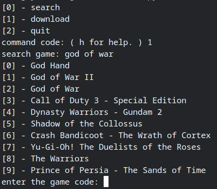

   

# ISO STORE
make your emulator games easy to install.

## description
The idea of this project came up when i got in trouble to install the game ISOs cuz it takes a really long time to find the game, download the zipped file and then extract it in the right folder. So i decided to create this time saver to download games `.iso` !!!  (+60 games available)

## installation
It's compatible with python3.10+ (It just deals with PS2 games for  now.)

### linux  OS

```txt
git clone https://github.com/lipe14-ops/isostore
cd isostore
pip install -r requirements.txt
chmod +x linux_installer.sh
./linux_installer.sh
```
## usage

### configuration
first you need to create a `config.json` file in the directory `.config/isostore` and add you config following this pattern: 
```json
{
    "download_dir":  "YOUR DOWNLOAD DIRECTORY",
    "extraction_dir":  "YOUR EXTRACTION DIRRECTORY"
}
```
now run the commnad `isostore`.  

### example


1. select you action by the index.
2. then search for a game.

If picked the option `[0]` you will just look up for the games... But if you choose the download option now the game will be installed... You can exit the application using `q` or `quit` and use the following commands to show the menu: `h`, `help`.

## Author:
</br>
<a href="https://github.com/lipe14-ops" style='padding: 15px' title="Rocketseat">Filipe Soares :computer:</a>
<p style='padding: 15px'>made with :heart: by <strong>Filipe</strong> :wave: reach me!!!</p>


[](fn697169@gmail.com)
[](https://www.instagram.com/filipe_kkkj/)
